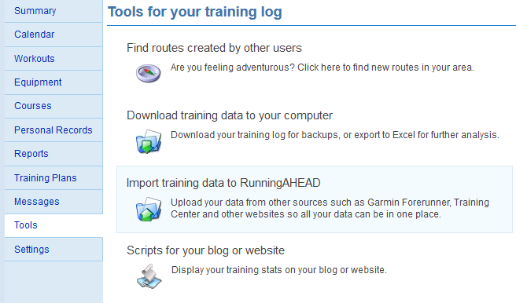
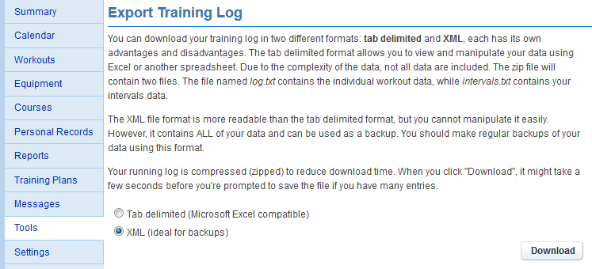
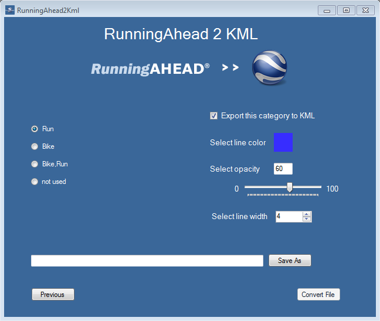
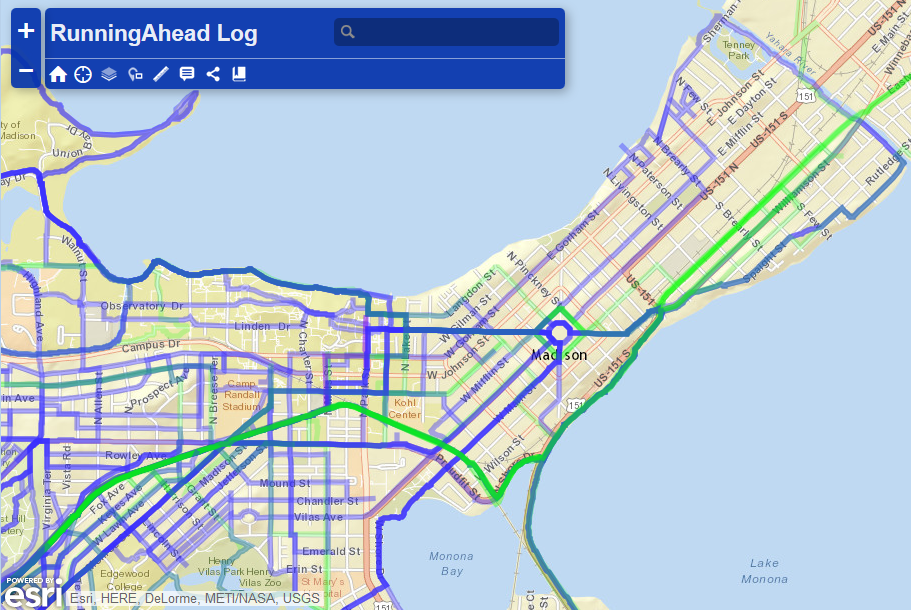

RunningAhead2Kml
================

Windows Desktop Application to convert a RunningAhead.com Training Log XML file to a KML file

RunningAhead2Kml allows RunningAhead.com users to convert their XML training log backup file to a KML that can be viewed in Google Earth or other mapping applications.

How to use
----------
* [Download RunningAhead2Kml.exe](https://github.com/jessemaps/RunningAhead2Kml/blob/master/Version1.0/RunningAhead2Kml.exe?raw=true)
* Download your Training Log XML backup file from RunningAhead.com (as zip file)  
  
  
* Unzip training log export - unzipped file will be log.xml
* Start RunningAhead2Kml.exe
* Select training log xml file (log.xml) and hit **_Next_**
* RunningAhead2Kml will analyze your training log and determine the different types of workout combinations that have used each route (i.e. Run, Bike, etc). Courses that have not been used in any workouts will be assigned the *not used* category. 
If a route has been used by a run and a bike workout, it will be named *Bike,Run*.  

  * Select a workout category on the left
  * Edit options for routes from the selected category
    * *Export this category to KML* - uncheck if you don't want the KML to include these courses
    * Select desired line color for courses of the selected category
    * *Select opacity* - number from 0-100 where the 0 draws the line completely transparent and 100 draws the line completely opaque.
    * Select desired line width for courses of the selected category
  * Click **_Save As_** to choose output name and destination for new KML file.
  * Click **_Convert File_** to perform the file conversion process.

Once your KML is created, you can open in Google Earth or view with online map services such as ArcGIS Online. Here's an example of what you can do with your KML file in ArcGIS Online:  

